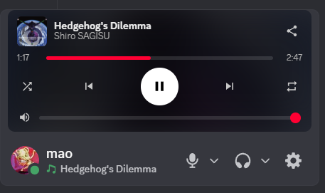

<p align="center">
  
</p>

## 🍐 Setup Pear Desktop + Discord

### 1. Enable API Server in Pear Desktop

Open Pear Desktop → go to:

```text id="z3qk9m"
Plugins → API Server [Beta]
```

Enable the plugin, then configure:

* **Port** → choose any (default: `26538`)
* **Authorization strategy** → `No authorization`

---

### 2. Install BetterDiscord plugin

* Copy `YouTubeMusicEnhance.plugin.js`
* Paste it into:

```text id="p1v8cn"
%appdata%\BetterDiscord\plugins\
```

* Restart Discord
* Enable the plugin in BetterDiscord → **Plugins**

---

### 2. bis (important)

Make sure the **port set in Pear Desktop matches the plugin configuration**.
The port can also be changed directly inside the plugin settings in BetterDiscord.

---

### 3. Verification

If everything is correct:

* Current track appears in Discord panel
* Controls (play / pause / next / previous) respond instantly
* Progress bar syncs with Pear Desktop

If it doesn’t work:

* Make sure Pear Desktop is running
* Check API Server is enabled
* Verify the port matches configuration
